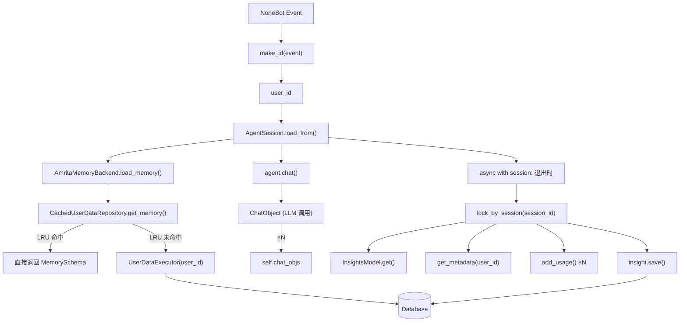
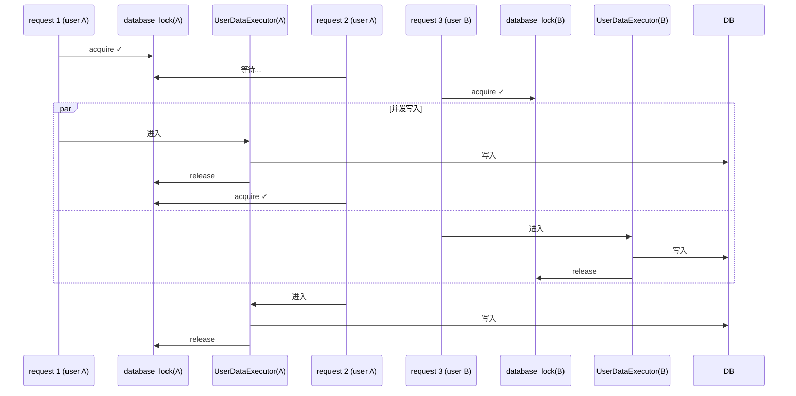
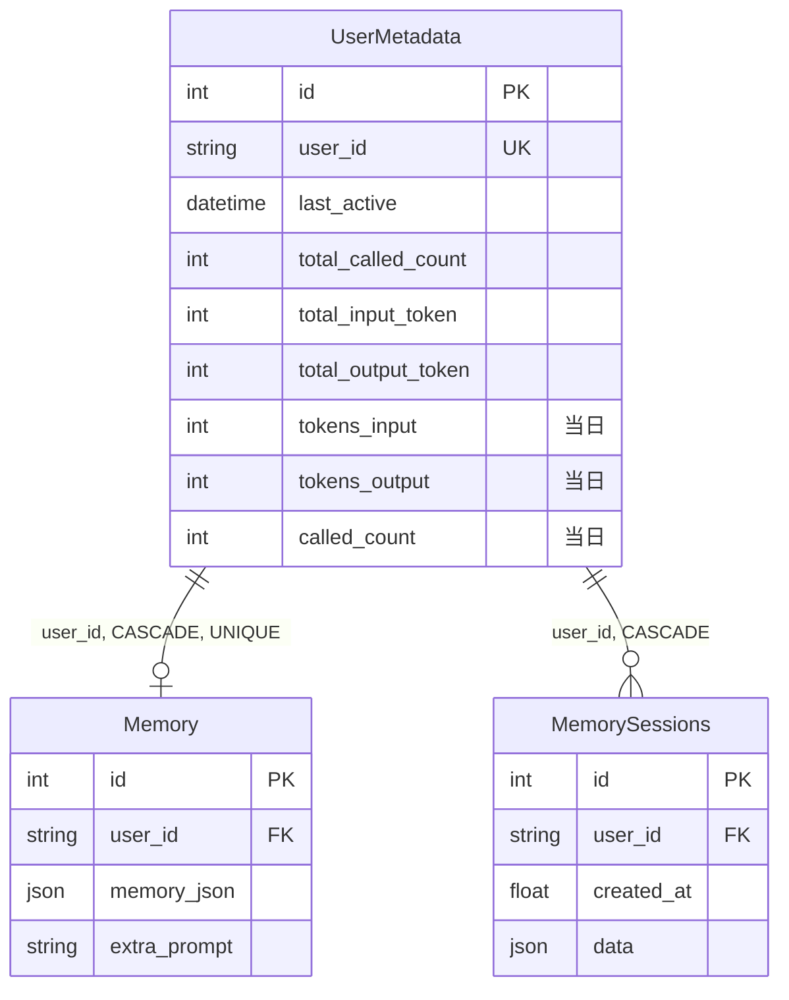

# nonebot-plugin-amrita


为 NoneBot2 提供 [AmritaCore](https://github.com/AmritaBot/AmritaCore) 集成支持。

---

## 安装

```bash
nb plugin install nonebot_plugin_amrita
```

## 配置

| 配置项                       | 类型        | 默认值           | 说明                               |
| ---------------------------- | ----------- | ---------------- | ---------------------------------- |
| `amrita_cookie_enable`       | `bool`      | `False`          | 是否启用 Cookie 鉴权               |
| `amrita_cookie`              | `str`       | 随机 16 位字符串 | 插件内部安全密钥（启用后自动生成） |
| `amrita_mcp_enable`          | `bool`      | `False`          | 是否启用 MCP                       |
| `amrita_mcp_clients`         | `list[str]` | `[]`             | MCP 客户端脚本路径列表             |
| `amrita_metadata_cache_size` | `int`       | `2048`           | 用户元数据本地缓存上限             |
| `amrita_memory_cache_size`   | `int`       | `512`            | 用户记忆本地缓存上限               |
| `amrita_lockpool_size`       | `int`       | `1024`           | 并发锁池容量                       |

> AmritaCore 自身的行为配置（如 `tool_call_limit`、`memory_token_limit`、`agent_mode` 等）需要在构造 `AmritaConfig` 时传入，不作为本插件的环境变量暴露。

### .env 示例

```env
AMRITA_COOKIE_ENABLE=true
AMRITA_MCP_ENABLE=true
AMRITA_MCP_CLIENTS='["client1","client2"]'
```

---

## 模块

### `agent` — Agent 会话

`AgentSession` 是 AmritaCore 运行时在 NoneBot2 中的封装。继承自 `AmRuntime`，内置用量统计和会话安全机制。

#### AgentSession

```python
from nonebot_plugin_amrita.agent import AgentSession
```

**类方法 `load_from`**

```python
@classmethod
async def load_from(
    cls,
    id_or_event: Event | str,          # NoneBot 事件对象或自定义用户 ID 字符串
    train: Message[str] | dict[str, str],  # 系统提示词 / 对话模板
    config: AmritaConfig | None = None,    # AmritaCore 配置，None 则使用全局
    preset: ModelPreset | None = None,     # 模型预设，None 则使用默认
    strategy: type[AgentStrategy] = ReActAgentStrategy,  # Agent 策略
    template: Template | str = DEFAULT_TEMPLATE,         # Jinja2 模板
    backend: BackendSlots | None = None,                 # 记忆后端
) -> AgentSession:
```

**实例方法**

| 方法                               | 说明                                       |
| ---------------------------------- | ------------------------------------------ |
| `async with session as agent:`     | 上下文管理器，退出时自动聚合并写入用量统计 |
| `await agent.chat(user_input)`     | 发送消息并获取 `ChatObject` 响应           |
| `agent.get_chatobject(user_input)` | 获取底层 `ChatObject`（内部使用）          |
| `agent.get_backend()`              | 获取 `AmritaMemoryBackend` 实例            |

**上下文管理器行为：** `__aexit__` 会遍历 session 期间所有 `ChatObject`，将 token 用量累加到当前日的 `InsightsModel` 和该用户的 `UserMetadataSchema`，然后写入数据库。整个过程受 `lock_by_session(session_id)` 保护。

**使用示例：**

```python
from nonebot import on_command
from nonebot.adapters import Event
from nonebot_plugin_amrita.agent import AgentSession

matcher = on_command("chat")

@matcher.handle()
async def handle_chat(event: Event):
    async with await AgentSession.load_from(
        id_or_event=event,
        train={"role": "system", "content": "你是一个助手"},
    ) as agent:
        response = await agent.chat("你好")
        await matcher.send(response.content)
```

#### SessionDepends

NoneBot2 依赖注入辅助，自动从事件中提取用户 ID 并构造 `AgentSession`。

```python
from nonebot_plugin_amrita.agent import SessionDepends

@matcher.handle()
async def handle_chat(
    session: AgentSession = SessionDepends(
        train={"role": "system", "content": "你是一个助手"},
        config=None,   # 可选
        preset=None,   # 可选
    )
):
    async with session as agent:
        response = await agent.chat("你好")
        await matcher.send(response.content)
```

> [!WARNING]
> **AmritaCore 与 NoneBot2 的依赖注入系统互不兼容。**
> AmritaCore 的 DI 属于 Agent 运行时内核层，与 NoneBot2 的 `Depends` 机制完全独立，不能混用。

## `database` — 数据持久化

基于 SQLAlchemy ORM（通过 `nonebot-plugin-orm`），管理四类数据：

| ORM 模型         | 表名                     | 说明                        |
| ---------------- | ------------------------ | --------------------------- |
| `GlobalInsights` | `amrita_global_insights` | 每日全局使用量统计          |
| `UserMetadata`   | `amrita_user_metadata`   | 用户级 Token 用量和调用次数 |
| `Memory`         | `amrita_memory_data`     | 用户对话记忆（JSON）        |
| `MemorySessions` | `amrita_memory_sessions` | 历史会话归档                |

#### `make_id(obj)`

将 NoneBot `Event` 或字符串标准化为统一用户 ID。
对 Event 调用 `obj.get_event_name()` + `obj.get_session_id()` 拼接，
直接传入字符串则原样返回。

```python
from nonebot_plugin_amrita.database import make_id

user_id = make_id(event)        # "message_abc123" 等（取决于适配器）
user_id = make_id("custom_id")  # 直接传入字符串
```

> [!WARNING]
> `make_id` 产出的 **user_id（用户标识）** 与 `MemorySessions` 表中的 **session_id（归档 ID）** 是两个概念，
> 不要混淆。user_id 用于区分不同用户/会话场景，session 归档 ID 是历史快照的主键。
>
> 推荐自定义 user_id 时使用 `"AdapterType_ExtraType_UserPayload"` 格式（如 `"OneBotV11_Group_1114514"`），
> 避免直接用 `event.get_session_id()`（该值在部分适配器中不稳定）。

#### `InsightsModel` (Pydantic)

全局每日统计的 Pydantic 层，封装了 `GlobalInsights` ORM 模型的读写和过期清理。

| 字段           | 类型  | 说明                    |
| -------------- | ----- | ----------------------- |
| `date`         | `str` | 日期，格式 `YYYY-MM-DD` |
| `token_input`  | `int` | 当日输入 token 总量     |
| `token_output` | `int` | 当日输出 token 总量     |
| `usage_count`  | `int` | 当日聊天请求次数        |

**类方法：**

```python
# 获取今日统计（不存在则自动创建）
insight = await InsightsModel.get(expire_days=7)
print(insight.token_input, insight.token_output, insight.usage_count)

# 获取所有日期的统计（自动清理 expire_days 之前的记录）
all_insights = await InsightsModel.get_all(expire_days=7)
for i in all_insights:
    print(i.date, i.usage_count)
```

**实例方法：**

```python
insight = await InsightsModel.get()
insight.usage_count += 1
await insight.save(expire_days=7)
```

#### `UserDataExecutor`

per-user 数据操作的上下文管理器。进入时获取 `database_lock(user_id)` 并开启事务，退出时自动提交/回滚。

```python
from nonebot_plugin_amrita.database import UserDataExecutor

async with UserDataExecutor(user_id) as exc:
    # 获取或创建用户元数据（自动在新的一天重置日计数）
    meta = await exc.get_or_create_metadata()
    meta.called_count += 1

    # 获取或创建用户记忆
    memory = await exc.get_or_create_memory()
    memory.memory_json = {...}

    # 读取会话归档（保留最近 20 条）
    sessions = await exc.get_or_load_sessions()

    # 添加 / 删除会话归档
    await exc.add_session(memory_model)
    await exc.remove_session(session_id_1, session_id_2)
```

**参数：**

| 参数                            | 说明                                                 |
| ------------------------------- | ---------------------------------------------------- |
| `user_id: str`                  | 用户唯一标识                                         |
| `session: AsyncSession \| None` | 外部事务的 session；传入时在已有事务内创建 savepoint |
| `with_for_update: bool`         | 是否对 SELECT 加 `FOR UPDATE` 行锁（用于更新场景）   |

**静态方法：**

```python
# 获取今日使用量 Top N 用户
top_users = await UserDataExecutor.get_top_users(limit=10)
for u in top_users:
    print(u.user_id, u.called_count, u.total_input_token)
```

---

## `memory` — 缓存与 Schema

#### `CachedUserDataRepository`（单例）

提供带 LRU 缓存的数据读取和脏标记追踪的增量写入。

```python
from nonebot_plugin_amrita.memory import CachedUserDataRepository

repo = CachedUserDataRepository()  # 全局单例

# 读取（优先从 LRU 缓存命中）
memory = await repo.get_memory("user_id_or_event")
metadata = await repo.get_metadata("user_id_or_event")
sessions = await repo.get_sesssions("user_id_or_event")   # 无缓存

# 增量写入（仅写脏字段）
metadata.called_count += 1
metadata.tokens_input += 100
await repo.update_metadata(metadata)  # 只写 called_count 和 tokens_input

memory.memory_json = new_memory_model
await repo.update_memory_data(memory)  # 只写 memory_json 字段
```

#### Schema 类型

| Schema                 | 说明                                       |
| ---------------------- | ------------------------------------------ |
| `UserMetadataSchema`   | 用户元数据（含 `get_dirty_vars()` 脏追踪） |
| `MemorySchema`         | 用户记忆（含脏追踪）                       |
| `MemorySessionsSchema` | 会话归档快照（无脏追踪）                   |

```python
from nonebot_plugin_amrita.memory import UserMetadataSchema, MemorySchema, MemorySessionsSchema

# 从 ORM 模型构造
meta = UserMetadataSchema.model_validate(orm_user_metadata)

# 脏追踪
meta.called_count += 1
print(meta.get_dirty_vars())  # {"called_count"}

# 手动标记"干净"
meta.clean()
```

#### `add_usage`

将 `UniResponseUsage` 累加到统计模型中。

```python
from nonebot_plugin_amrita.memory import add_usage

add_usage(insights_model, chat_object.response.usage)    # 全局统计
add_usage(metadata_schema, chat_object.response.usage)   # 用户统计
```

---

## `config` — 插件配置

```python
from nonebot_plugin_amrita.config import config, Config

cfg = config()
print(cfg.amrita_metadata_cache_size)

# 运行时替换配置
from nonebot_plugin_amrita import replace_config
replace_config(Config(amrita_mcp_enable=True))
```

---

## `lock` — 锁原语（内部使用）

基于 `aiologic.Lock` + `WeakValueLRUCache`，提供死锁检测。

```python
from nonebot_plugin_amrita.lock import database_lock, lock_by_session

async with database_lock(user_id) as lock:
    # 控制 per-user 数据并发

async with lock_by_session(session_id) as lock:
    # 控制 Agent session 串行化
```

> `aiologic.Lock` 不可重入，同一协程重复 acquire 会抛出 `RuntimeError`。

---

## 架构

### 数据流



### 并发模型



- **Per-user 写互斥**：同一用户的多个请求通过 `database_lock(user_id)` 串行化
- **Session 串行化**：同一 Agent session 的退出逻辑通过 `lock_by_session(session_id)` 保护
- **死锁防护**：`UserDataExecutor` 已持 per-user 锁时，内部调用 `MemorySessions.get(no_lock=True)` 跳过重复加锁

### ORM 模型关系



---

## FAQ

#### Q: 如何自定义用户 ID？

A: 向 `AgentSession.load_from(id_or_event=...)` 传入自定义字符串。
推荐格式见上方 `make_id` 处的 WARNING 块。

#### Q: 如何清理用户数据？

```python
from nonebot_plugin_orm import get_session
from nonebot_plugin_amrita.database import Memory, UserMetadata, MemorySessions
from sqlalchemy import delete

async with get_session() as session:
    async with session.begin():
        await session.execute(delete(Memory).where(Memory.user_id == "user_id"))
        await session.execute(delete(UserMetadata).where(UserMetadata.user_id == "user_id"))
        await session.execute(delete(MemorySessions).where(MemorySessions.user_id == "user_id"))
```

#### Q: 如何传入自定义 `AmritaConfig` / `ModelPreset`？

```python
from amrita_core import AmritaConfig, ModelPreset

custom_config = AmritaConfig(...)
custom_preset = ModelPreset(name="custom", model_name="gpt-4", ...)

async with await AgentSession.load_from(
    event, train={...}, config=custom_config, preset=custom_preset
) as agent:
    ...
```

#### Q: plugin metadata 描述是什么？

本插件是 **library** 类型，不提供开箱即用的命令。你的插件需要自行导入 `AgentSession` 并在 matcher 中使用。
